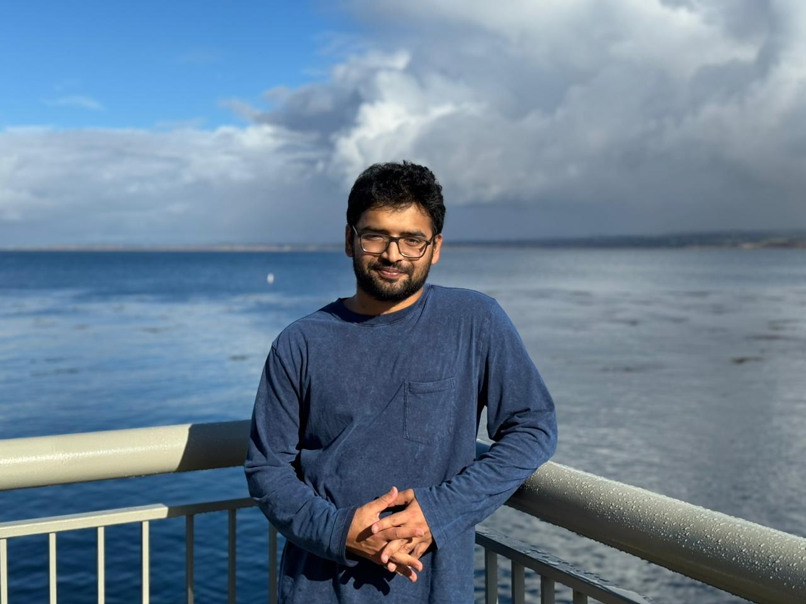

  
  

    <h1>Mohammad Omar Khursheed</h1>
  

I am an Applied Scientist at Amazon, where I work on developing efficient machine learning systems for speech recognition. My research focuses on creating robust and fair deep learning architectures for resource-constrained environments, with a particular interest in the intersection of model efficiency and speech representations.

My work explores how to optimally balance information preservation with constraints of memory and compute, developing solutions for real-world deployment challenges. Recent projects include designing dynamically slimmable transformers for keyword spotting and investigating fairness considerations in speech processing systems.

## Research Interests
- Efficient Deep Learning Architectures
- Speech Recognition & Keyword Spotting
- Machine Learning Fairness
- Self-supervised Speech Representation Learning

<a href="/publications">View Publications</a> | <a href="https://github.com/omarkhursheed">GitHub</a> | <a href="https://linkedin.com/in/mkhursheed">LinkedIn</a>

